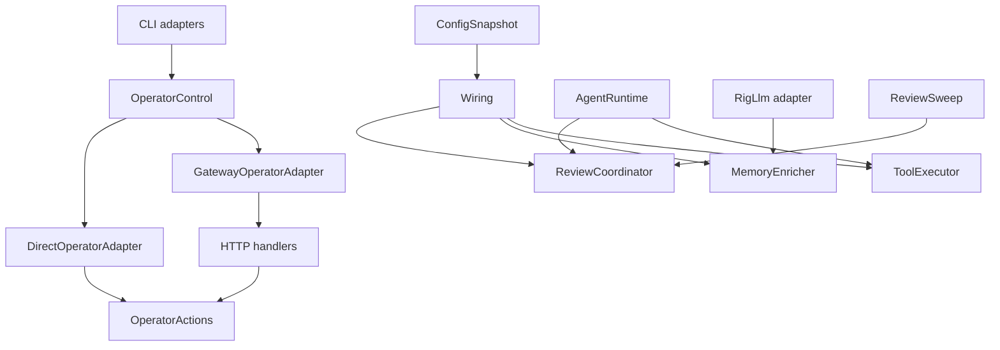
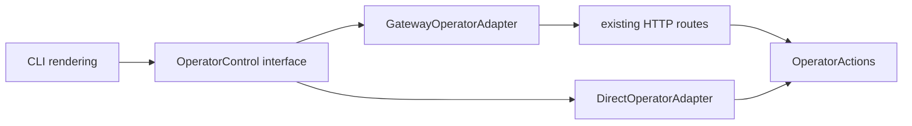

# Komo 架构深化方案

- 状态：Implemented（2026-07-11，commits bb5348f…b781243；§11 全部结构检查通过）
- 范围：operator control、resolved configuration、tool execution、memory enrichment、review orchestration
- 原则：渐进迁移；保持 CLI、HTTP 路由、持久化格式和用户行为兼容

## 1. 背景与目标

Komo 当前的核心能力已经完整：gateway 常驻、CLI 经 loopback HTTP 路由、工具循环、memory recall、reviewer、run ledger 都已落地。当前问题不是缺少能力，而是部分实现随着能力增长变得 shallow：caller 需要知道过多选择规则、执行顺序和失败语义。

本方案深化五个 module：

1. operator control
2. resolved configuration
3. tool execution
4. memory enrichment
5. review coordinator

目标是：

- 缩小 caller 必须学习的 interface。
- 把锁、重试、watermark、prompt 顺序等 invariant 收进 implementation。
- 只在真实变化点建立 seam；已有两个 adapter 才抽 port。
- 让新 module 的 interface 同时成为 caller interface 和测试面。
- 每个阶段都能独立合并、回滚和验证，不做大爆炸式重构。

非目标：

- 不改变现有 `/api/*` HTTP 路由或 OpenAI-compatible chat 路由。
- 不重做 Turso owner model；gateway 常驻仍是正常运行模式。
- 不改变 config 的优先级：built-in defaults < `config.toml` < `KOMO_*`。
- 不改变 tool retry、审批、ledger、预算和结果截断的语义。
- 不调整 memory 排名算法、dreaming 判据或 reviewer prompt。
- 不合并 `SessionRepository` 与 `MessageRepository`；这可以作为后续独立议题。

## 2. 共享设计约束

### 2.1 Module depth

每个目标 module 都必须通过 deletion test：删除它后，复杂度应重新散落到多个 caller，而不是直接消失。

### 2.2 Seam discipline

- #1 已有 gateway HTTP 与 direct persistence 两个生产 adapter，是一个真实 seam。
- #3 已有多个 `Tool` adapter，是一个真实 seam。
- #2、#4、#5 都只有一个生产 implementation，不新增仅为测试存在的 public trait；测试通过构造依赖或现有 repository/LLM seam 完成。
- internal seam 可以存在，但不暴露给 caller。

### 2.3 Replace, don't layer

迁移期间允许新旧路径短暂共存；一个 caller 迁移完成后，删除对应旧分支和旧测试。最终测试只通过新 module interface 验证行为，不保留重复测试层。

### 2.4 行为兼容

以下 invariant 在整个迁移中保持：

- gateway 可达时，CLI 不直接打开 Turso 文件。
- gateway 不可达时，CLI 仍能直接执行支持的 operator 动作。
- operator 写操作继续受 loopback gate 保护。
- Codex 继续使用 OAuth；不能退化为 API-key 检查。
- memory 注入顺序继续是 base preamble → pinned → recall。
- aux recall 失败、超时或回复非法时继续 lexical fallback。
- review 成功后才推进 watermark；watermark 写失败只会导致将来重复 review。
- tool ledger 写失败不改变 tool 自身结果。

## 3. 总体结构



## 4. Candidate 1：深化 operator control module

### 4.1 当前 friction

当前 adapter 选择泄漏到多个 CLI module：

- `src/cli/inspect.rs`
- `src/cli/memory.rs`
- `src/cli/pair.rs`
- `src/cli/dream.rs`
- `src/cli/resume.rs`
- `src/cli/doctor.rs`
- `src/cli/skill.rs`
- `src/cli/app.rs`

这些 caller 都需要知道：

1. 调用 `GatewayClient::try_connect`。
2. gateway 可达时调用哪个 HTTP 方法。
3. gateway 不可达时连接 `Db`、`KanbanDb` 或 `MemoryDb` 中的哪一个。
4. 两条路径的结果如何转换成相同输出。
5. 404、version skew、lock ownership 和 batch reuse 如何处理。

server 侧的 `ApiChannel::new` 接收大量 repository，`AppState` 同时承担 HTTP transport state 和 operator use case dependencies。部分 DTO 还定义在 `infra/messaging/api.rs`，导致 CLI client 反向依赖 server transport module。

`src/tui/mod.rs` 也使用 `GatewayClient` 选择 remote/local chat backend。这个选择属于 chat data path，不并入 operator control；只有 TUI resume 前的 session 查询适合复用 operator query。

近期 `464bc79`、`8f3f5b3`、`b0e2cd9` 都继续修改这条路径，说明这里有较高 leverage。

### 4.2 目标 module

建议新增：

```text
src/services/operator_control/
├── mod.rs          # external interface
├── request.rs      # typed requests/replies
├── actions.rs      # shared operator implementation
├── direct.rs       # direct persistence adapter
└── gateway.rs      # GatewayClient adapter
```

`infra/messaging/api.rs` 只负责 HTTP decode/encode、auth 和 loopback gate；operator 行为进入 `OperatorActions`。

现有 `GatewayClient::chat` 继续服务 TUI/chat path。实现时可以把公共 bearer/timeout/URL 逻辑下沉为 package-private `GatewayHttp`，由 chat client 与 `GatewayOperatorAdapter` 共享，但二者不合并成一个更宽的 public interface。

### 4.3 External interface

不把所有动作压成无类型 JSON，也不增加与所有 HTTP endpoint 一一对应的二十多个 public method。建议使用两个 typed interface：

```rust
pub struct OperatorControl {
    backend: OperatorBackend,
}

impl OperatorControl {
    pub async fn connect(urls: StoreUrls) -> anyhow::Result<Self>;

    pub async fn query(
        &self,
        query: OperatorQuery,
    ) -> anyhow::Result<OperatorQueryResult>;

    pub async fn command(
        &self,
        command: OperatorCommand,
    ) -> anyhow::Result<OperatorCommandResult>;
}
```

示意类型：

```rust
pub enum OperatorQuery {
    Reminders,
    Tasks,
    Runs { limit: usize },
    Run { id: String },
    Sessions,
    Memories { status: Option<MemoryStatus> },
    Pairings,
    DreamPreview,
    SkillAudit { name: String },
    HomeOverride,
}

pub enum OperatorCommand {
    MemoryTransition { id: String, action: MemoryAction },
    PruneRuns { cutoff: i64 },
    CleanSessions,
    PairApprove { code: String },
    PairRevoke { id: String },
    DreamApply,
    ResumeRun { id: String },
}
```

返回值同样使用 typed enum。CLI 必须穷举匹配结果，避免 transport JSON 字段名成为 caller interface。

### 4.4 Internal implementation

`OperatorControl::connect` 每条 CLI 命令只探测 gateway 一次：

- 可达：构造 `GatewayOperatorAdapter`。
- 不可达：构造 `DirectOperatorAdapter`。

`DirectOperatorAdapter` 不应启动时一次打开三个数据库。它保存 `StoreUrls`，按 request 懒连接需要的 store，并在同一命令内复用连接。这样 `run list` 不会无意义地打开 memory/kanban store，batch memory transition 也不会每个 id 重新连接。

`OperatorActions` 持有 repository 和可选的 `MessageHandler`，承载两条路径必须一致的行为：

- memory transition
- run resume eligibility 与 prompt assembly
- pair approve outcome
- dream preview/apply
- skill audit projection
- session/run/task/memory summary projection

HTTP handler 与 direct adapter 都调用 `OperatorActions`。`GatewayOperatorAdapter` 继续映射到现有 `/api/*` 路由；不引入一个万能 `/api/execute` endpoint。

### 4.5 Adapter seam



两个 adapter 必须运行同一份 contract suite。生产差异只允许存在于：

- transport 与认证
- connection ownership
- HTTP status ↔ domain error 映射

业务结果不允许分叉。

### 4.6 迁移步骤

1. 把 `SessionSummary`、`PairingView`、`SkillInvocation`、`ResumeOutcome`、`DreamItem` 从 `infra/messaging/api.rs` 移到 operator module。
2. 创建 `OperatorActions`，先迁移纯 projection：sessions、pairings、dream preview、skill audit。
3. 新增两个 adapter 和共享 contract tests。
4. 迁移 read-only CLI：cron/task/run/session/memory list、doctor、skill audit。
5. 迁移 write CLI：memory transition、pair、prune、clean、dream apply、resume。
6. 让 TUI 的 session existence query 使用 operator control；remote/local chat backend 选择保持独立。
7. 缩小 `ApiChannel::new`：用 `Arc<OperatorActions>` 替代可由它覆盖的 repository 参数。
8. 删除 operator CLI 内所有直接 `GatewayClient::try_connect` 分支；operator backend 探测只保留在 operator module。

### 4.7 Test surface

contract suite 至少覆盖：

- gateway available / unavailable 的 adapter 选择。
- stale rendezvous fallback。
- 旧 gateway 404 的 version-skew 提示。
- HTTP 与 direct memory transition 结果相同。
- pair approve 的 Approved / NotFound / Locked。
- run resume 的 missing / not recoverable / success。
- batch command 在一次 backend resolution 上执行。
- secret hash/salt 不出现在 `PairingView`。

### 4.8 Acceptance criteria

- `GatewayClient` 不再被 operator CLI render module 直接引用。
- `GatewayClient::try_connect` 只允许存在于 operator adapter resolution 和独立的 TUI chat connection path。
- operator DTO 不再定义在 HTTP transport module。
- `ApiChannel::new` 参数显著减少。
- 两个 adapter 通过同一 contract suite。

### 4.9 Rejected designs

- **万能 JSON execute endpoint**：interface 无类型，错误只能运行时发现。
- **给每个 endpoint 建一个 trait method**：把 HTTP surface 原样复制成 shallow interface。
- **direct adapter eager-open 三个数据库**：增加无关锁与启动成本。
- **把 TUI chat backend 也塞进 OperatorControl**：混合 chat 与 operator 两种生命周期，扩大 interface。
- **借机重做 gateway owner model**：超出本方案范围，也违背 gateway 常驻的正常运行模式。

## 5. Candidate 2：配置一次解析成 resolved snapshot

### 5.1 当前 friction

`src/config.rs` 同时公开 raw structs、source loaders 和大量独立 resolver。`gateway`、`wiring`、`doctor`、`model` 分别调用：

- `FileConfig::load`
- `KomoEnv::load` / `load_lenient`
- `Secrets::load`
- `maintenance_schedule`
- `briefing_schedule`
- `dream_schedule`
- `policy_report`
- 各 channel `*_config`
- `ModelConfig::resolve`

结果是同一启动过程多次读取 `config.toml` 和 `.env`，caller 还需要知道 strict/lenient、优先级、默认值和 credential 缺失语义。`doctor` 明确重新实现了 model source priority。

### 5.2 目标 module

把单文件迁为：

```text
src/config/
├── mod.rs          # ConfigSnapshot external interface
├── sources.rs      # file/env/secrets raw loading
├── resolved.rs     # precedence/defaults/validation
├── report.rs       # redacted diagnostics + provenance
└── write.rs        # model selection write path
```

raw structs 保持 private 或 `pub(crate)`；caller 只消费 resolved types。

### 5.3 External interface

```rust
pub struct ConfigSnapshot {
    pub runtime: RuntimeConfig,
    pub report: ConfigReport,
}

impl ConfigSnapshot {
    pub fn load() -> anyhow::Result<Self>;
    pub fn from_sources(sources: ConfigSources) -> Self;
    pub fn validate_gateway(&self) -> anyhow::Result<()>;
}
```

`from_sources` 是纯 resolution seam，测试直接提供值，不修改真实进程环境。

`ConfigSnapshot` 一次包含：

- home 与三个 store URL
- model/provider/base URL/aux model
- max turns/history/tool-result cap/review interval
- schedules 与 workday gate
- policy
- channel configs
- skills paths
- redacted diagnostics 与每个值的 provenance

### 5.4 Strict 与 diagnostic 语义

不建立两套 resolution logic：

- `load` 总是尽可能完成解析，并把问题记录为 `ConfigIssue`。
- gateway 调 `validate_gateway`，对启用 channel 缺 credential、非法 schedule 等 fatal issue 失败。
- doctor 直接展示 `report`，包括 fatal issue，但不会因为第一个问题提前退出。

`ConfigIssue` 至少包含：

```rust
pub struct ConfigIssue {
    pub path: &'static str,
    pub severity: IssueSeverity,
    pub message: String,
}
```

### 5.5 Secret handling

- raw secrets 仍只从 `.env` / process env 读取。
- `RuntimeConfig` 和 channel credential types 不实现自动 `Debug`，或手写 masked `Debug`。
- `ConfigReport` 只记录 present/missing 和来源，不含 secret 值。
- Codex auth 继续由 `CodexAuth::load` 检查，不能走 `Secrets::key`。

### 5.6 Snapshot lifetime

gateway 在启动时创建一个 snapshot 并传给 `wiring::build` 与 `gateway::run`。本方案不增加 config hot reload：

- model/provider 变更仍需 restart 才影响长驻 gateway。
- skill registry 的文件热加载保持独立，不受 snapshot 影响。
- per-turn 日期仍由 `SystemPromptBuilder` 动态构造，不进入启动 snapshot。

### 5.7 迁移步骤

1. 引入 `ConfigSources` 与纯 resolution tests，保持旧 public resolver 作为薄兼容入口。
2. 引入 `ConfigSnapshot`，让 `doctor` 首先迁移，验证 report 完整性。
3. 修改 `wiring::build` 接收 `&ConfigSnapshot`，停止内部重新 load。
4. 修改 `gateway::run` 接收 snapshot，停止逐个调用 channel resolver。
5. 修改 `model list` 使用同一 provenance/report；`model set` 保留独立 write path。
6. 删除旧 free resolver 和重复 strict/lenient 分支。
7. 将 `src/config.rs` 迁为目录 module。

### 5.8 Test surface

使用 table-driven tests 覆盖：

- default < file < env 的完整优先级。
- 空字符串正规化为 unset。
- channel disabled 时缺 secret 不报 fatal。
- channel enabled 时缺 secret 产生一个确定 issue。
- API channel 默认 loopback/ephemeral/auto-key。
- external API bind 必须有 key。
- dream schedule default-on 与 off aliases。
- Codex OAuth diagnostics 不依赖 API key。
- `ConfigReport` 不包含任何 secret 内容。
- 同一 sources 对 gateway 与 doctor 生成一致结果。

### 5.9 Acceptance criteria

- gateway 启动只读取一次 file/env/secrets。
- `wiring.rs`、`gateway.rs` 不直接调用 `FileConfig::load`、`KomoEnv::load`、`Secrets::load`。
- `doctor.rs` 不再复制 model/config precedence。
- raw config structs 不进入 application caller。
- 所有 secret-bearing types 的 debug 输出均已脱敏。

### 5.10 Rejected designs

- **全局 OnceLock config**：破坏测试隔离，也让未来 reload 更困难。
- **doctor 继续用 lenient 第二套 resolver**：会再次产生事实分叉。
- **snapshot 自动热加载**：当前没有消费需求，增加并发与一致性成本。

## 6. Candidate 3：让 ToolRegistry 成为 tool-execution module

### 6.1 当前 friction

`ToolRegistry` 当前只拥有 `register`、`get`、`tools`。真正的执行 implementation 位于同文件的 free function 和 globals：

- `execute_isolated`
- session/run task-local
- panic isolation
- retry classification/backoff
- tool-call budget
- run ledger step
- tracing span
- result cap
- process-wide `OnceLock` config

`AgentRuntime` 必须自己做 name lookup、unknown-tool translation、并行执行和 error-to-outcome conversion；`RigTool` 又单独调用 `execute_isolated`。

删除当前 `ToolRegistry` 只会移动一个 `HashMap`，因此它是 shallow module。

### 6.2 目标 module

```text
src/services/tool_execution/
├── mod.rs          # ToolExecutor external interface
├── catalog.rs      # immutable tool catalog
├── context.rs      # per-turn explicit context
├── retry.rs        # classification/backoff
├── ledger.rs       # best-effort step recording
└── result.rs       # cap + ToolOutcome mapping
```

### 6.3 External interface

```rust
pub struct ToolExecutor {
    core: Arc<ToolExecutionCore>,
}

pub struct ToolExecutionConfig {
    pub max_result_bytes: usize,
    pub max_calls_per_turn: i64,
}

pub struct ToolTurnContext {
    pub session: SessionContext,
    pub run: Option<RunContext>,
}

impl ToolExecutor {
    pub fn register(&mut self, tool: Arc<dyn Tool>);
    pub fn definitions(&self) -> Vec<Arc<dyn Tool>>;

    pub async fn execute_round(
        &self,
        calls: &[ToolCallReq],
        context: ToolTurnContext,
    ) -> Vec<ToolOutcome>;
}
```

caller 不再接触 tool lookup、`execute_isolated` 或 error formatting。`execute_round` 保序并行执行，直接返回可以交给 `TurnDriver::step` 的 `ToolOutcome`。

`definitions` 是 model adapter 构造 tool schema 所需的只读 view；不允许通过它绕开 executor 执行。

### 6.4 Explicit context 与兼容桥

目标 interface 显式传递 `ToolTurnContext`，避免 executor 自己从 ambient global 猜测 run/session。

当前 `PolicyApprover` 和 session-scoped tool 仍通过 `current_session()` 读取 task-local。第一阶段不修改所有 `Tool` adapter：executor 在内部 spawn 时把 explicit session context 安装到现有 task-local。这样 task-local 从 caller contract 降级为 internal compatibility seam。

`RunContext` 也由 runtime 明确传入 executor；ledger seq 和 budget 不再依赖任意 caller 是否恰好建立了 ambient scope。

### 6.5 Execution invariants

implementation 内保持当前顺序：

1. 根据 tool name 查 catalog。
2. claim ledger seq；预算按 logical call 计算，不按 retry attempt 计算。
3. redact args。
4. 在隔离 task 中执行，并安装 session context 与 tracing span。
5. panic/cancellation 转换为错误。
6. 根据 typed `RetryHint` 优先、文本 marker 兜底判断 retry。
7. ledger 记录原始、截断后的审计字段。
8. 给 LLM 的结果应用 `max_result_bytes` cap。
9. 转成 `ToolOutcome`；unknown tool 和 tool error 都返回给模型恢复，不中止 turn。

### 6.6 Rig adapter

`RigTool` 继续满足 rig 的 `ToolDyn`，但它和 `AgentRuntime` 必须共享同一个 `ToolExecutionCore`：

- schema path 读取 catalog。
- trait-required `call` fallback 委托 core。
- 不在 `RigTool` 中复制 retry/ledger/cap。

实现时避免引用环：`ToolExecutionCore` 只持有 `Arc<dyn Tool>` 和 config，不持有 `RigTool`；`ToolExecutor` 与每个 `RigTool` 都持有 core 的 `Arc`。

### 6.7 迁移步骤

1. 将 `cap_tool_result`、retry classifier 和 ledger recorder 移入 internal modules，不改变 external behavior。
2. 引入 instance-owned `ToolExecutionConfig`，删除 `set_tool_result_cap` / `OnceLock`。
3. 引入 `execute_round`，迁移 `AgentRuntime::run_agent_loop`。
4. 修改 runtime：`tools: Arc<ToolRegistry>` → `tool_executor: Arc<ToolExecutor>`。
5. 修改 `RigTool` 共享 execution core。
6. 把 `execute_isolated` 改为 private，迁移测试到 `ToolExecutor` interface，最后删除 free function。
7. 评估 task-local 是否仍有其他 caller；若只有 executor 内部使用，更新注释明确它是 compatibility seam。

### 6.8 Test surface

现有 tool registry 测试可以迁移为 interface tests：

- unknown tool 转成 outcome。
- panic/cancellation 不崩进程。
- connection-level error 对任何 tool retry。
- ambiguous error 只对 idempotent tool retry。
- terminal error 不 retry。
- retry attempt 只形成一个 ledger step。
- 并行 round 保持 outcome 顺序。
- budget 按 logical call 计数。
- redaction 发生在 ledger 前。
- ledger 失败不改变 tool result。
- LLM result cap 不截断 UTF-8。
- 两个 executor instance 可以拥有不同 cap，证明已消除 process global。

### 6.9 Acceptance criteria

- `execute_isolated` 不再是 public free function。
- `AgentRuntime` 不做 tool name lookup 或 error formatting。
- `set_tool_result_cap` 和 `OnceLock` 删除。
- 所有 tool execution path 经过同一个 core。
- tool execution tests 只通过 `ToolExecutor` interface。

### 6.10 Rejected designs

- **一次性修改 `Tool::execute` 接收完整 context**：迁移面过大；先用 executor internal bridge。
- **让 runtime 继续 lookup、executor 只包一层 execute**：删除后复杂度不会重新分散，仍然 shallow。
- **RigTool 保留独立 fallback logic**：形成第二条执行语义。

## 7. Candidate 4：从 RigLlm 抽回 memory enrichment

### 7.1 当前 friction

`RigLlm::assemble` 当前同时负责：

- session → prompt/history 转换
- system preamble
- memory store single-load
- `MemoryContext` scope
- pinned selection
- recall selection
- aux screening + timeout/fallback
- prompt block rendering
- recall usage tracking

其中只有 prompt/history 与 provider transport 直接属于 LLM adapter。memory policy 泄漏进 `infra/llm.rs`，导致未来新增 LLM adapter 时必须复制或绕过这套逻辑。

`agent/system_prompt.rs` 又持有 memory block rendering，与 selection 分离，测试跨两个 module。

### 7.2 命名

已有 `domain::memory::MemoryContext` 表示 scope，因此新 module 不再使用 `MemoryContext` 名称，避免一词两义。建议命名：

```text
src/services/memory_enrichment.rs
```

类型名：`MemoryEnricher`、`MemoryPrefix`。

### 7.3 External interface

```rust
pub struct MemoryEnricher {
    memories: Arc<dyn MemoryRepository>,
    aux: Option<Arc<dyn LlmClient>>,
    config: MemoryEnrichmentConfig,
}

impl MemoryEnricher {
    pub async fn enrich(
        &self,
        session_id: &str,
        user_message: &str,
    ) -> Option<MemoryPrefix>;
}

pub struct MemoryPrefix(String);
```

`MemoryPrefix` 是已经按 pinned → recall 排序并带安全 marker 的完整 suffix。caller 不看到 selected ids、scores、usage hashes 或 aux reply。

这里只有一个 production implementation，不新增 `MemoryEnricher` trait。测试使用现有 `MemoryRepository` 和 `LlmClient` seam 注入 fake adapter。

### 7.4 Internal implementation

`enrich` 内部执行：

1. `MemoryRepository::list` 一次。
2. 从 session id 建立已有 `MemoryContext`。
3. 选择 pinned，并记录 ids 防止 recall 重复注入。
4. 宽取 recall candidates。
5. 超过注入上限时调用 aux screen。
6. 严格校验 aux ids 与 condensation 长度；失败则 lexical fallback。
7. 渲染 pinned/recall blocks，保持预算和完整行截断。
8. 只对真正注入的 recall ids 异步 `mark_used`。
9. memory store 或 usage update 失败只记录 warning，不阻断回复。

当前 `render_pinned_memory_block` 与 `render_recalled_memory_block` 移入该 module，成为 private implementation。`domain/memory.rs` 保留纯 scope、ranking、dreaming 规则。

### 7.5 RigLlm 的目标职责

`RigLlm::assemble` 最终只保留：

- 找到 last user message。
- window history，并确保不以 assistant 开头。
- rebuild base preamble。
- 调 `MemoryEnricher::enrich` 并 append prefix。
- 转换为 rig messages。

`build_llm` 接收已经由 wiring 构造的 `Option<Arc<MemoryEnricher>>`，而不是分别接收 memory repository 与 aux LLM。

### 7.6 Prompt cache invariant

迁移不得改变字节顺序：

```text
stable identity/tools/skills
context instructions
volatile date/model/provider
pinned memory
recalled memory
```

没有 memory 时不附加空行或 marker。pinned 跨 turn 相对稳定，recall 最冷，继续放在最后。

### 7.7 迁移步骤

1. 新建 `MemoryEnricher`，先复制现有逻辑并用 characterization tests 固定输出。
2. 移入两种 memory block renderer 和相关 budgets/markers。
3. wiring 构造 enricher；main LLM 得到 `Some`，aux/delegate LLM 得到 `None`。
4. `RigLlm::assemble` 改为一次 `enrich` 调用。
5. 删除 `RigLlm` 的 `memories`、`aux` 字段及 aux recall helper。
6. 删除 `agent/system_prompt.rs` 中的 memory rendering exports 与重复测试。

### 7.8 Test surface

- empty store 返回 `None`，不改变 prefix。
- pinned 与 recall 顺序固定。
- pinned 不重复出现在 recall。
- scope/status/expiry 不被 renderer 放宽。
- candidate confidence 和 source tags 保留。
- candidate 少于等于上限时不调用 aux。
- aux valid selection、fabricated id、invalid JSON、timeout、empty result。
- condensation 超限回落原文。
- 只对实际注入 ids 调 `mark_used`。
- store/usage failure 不阻断 enrichment。
- 整体 budget 不切断多字节字符，不输出半行。
- main LLM 有 enrichment，aux/delegate LLM 没有 memory library。

### 7.9 Acceptance criteria

- `infra/llm.rs` 不导入 `select_pinned`、`select_recall`、`recall_query_hash` 或 memory renderers。
- `RigLlm` 不直接持有 `MemoryRepository`。
- memory injection 的全部测试通过 `MemoryEnricher::enrich`。
- prompt cache ordering 的 characterization test 保持通过。

### 7.10 Rejected designs

- **为 enricher 新增 public trait**：只有一个 production implementation，是 hypothetical seam。
- **把 ranking 也移出 domain/memory.rs**：ranking 是纯 domain rule，应留在 domain module。
- **让 runtime 拼接 rig-specific prompt**：把 provider adapter 细节反向泄漏到 runtime。

## 8. Candidate 5：集中 review orchestration

### 8.1 当前 friction

同一 correctness protocol 存在两份：

`AgentRuntime::turn_body`：

1. count user turns
2. cadence check
3. full session reload
4. spawn review
5. success 后 mark watermark

`ReviewSweep::run`：

1. scan review candidates
2. eligibility check
3. full session reload
4. review
5. success 后 mark watermark

两条路径分别维护 error isolation、logging 与 watermark 语义。它们还可能在同一 session 上并发 review；现有 dedup 能降低副作用，但仍产生重复 LLM 成本。

### 8.2 目标 module

建议新增：

```text
src/agent/review_coordinator.rs
```

`ReflectiveReviewer` 继续负责 transcript → memories/skills/tasks；`ReviewCoordinator` 负责何时 review、加载哪个 snapshot、并发和 watermark。

### 8.3 External interface

```rust
pub enum ReviewTrigger {
    AfterTurn { session_id: String },
    Scheduled,
}

pub struct ReviewReport {
    pub sessions_reviewed: usize,
    pub memories_written: usize,
    pub skills_written: usize,
    pub tasks_captured: usize,
}

pub struct ReviewCoordinator { /* dependencies + keyed in-flight state */ }

impl ReviewCoordinator {
    pub async fn run(
        &self,
        trigger: ReviewTrigger,
    ) -> anyhow::Result<ReviewReport>;
}
```

一个 interface 覆盖两个 trigger。caller 不传 `user_turns` 或 watermark，避免把 eligibility knowledge 泄漏出去。

### 8.4 Internal implementation

`AfterTurn`：

- 查询真实 user-turn count。
- 不命中 `review_interval` 时返回 empty report。
- full-load session。
- 调共用 `review_one(session, through)`。

`Scheduled`：

- 查询 `review_candidates` projection。
- 跳过 `user_turns == 0` 或 `user_turns <= reviewed_through`。
- full-load 每个 eligible session。
- 调同一个 `review_one`。
- 单 session 失败记录 warning 并继续，不中止整个 sweep。

`review_one`：

1. 获取 per-session in-flight guard。
2. 如果已经在 review，跳过；已有执行成功会推进 watermark，失败则下次 sweep 重试。
3. 调 `Reviewer::review`。
4. 聚合 `ReviewOutcome`。
5. success 后 best-effort `mark_reviewed(through)`。

in-flight guard 使用进程内 keyed set 足够：gateway 是 review 的唯一运行 owner；crash 后 watermark 未推进，下一次 sweep 会恢复。当前没有必要增加持久化 claim 字段。

### 8.5 Wiring 变化

- `wiring::build` 创建一个 `Arc<ReviewCoordinator>`。
- `AgentRuntime` 持有 coordinator，不再持有 `reviewer + review_interval`。
- `ReviewSweep` 只持有 coordinator，并把 `ReviewReport` 映射到 `MaintenanceSummary`。
- gateway 的 post-turn 与 scheduled path 共享同一个 coordinator instance，因此 in-flight guard 有效。

### 8.6 迁移步骤

1. 新建 coordinator 与 `review_one`，用现有 daemon watermark tests 建 characterization tests。
2. 让 `ReviewSweep` 委托 `ReviewTrigger::Scheduled`。
3. wiring 创建并共享 coordinator。
4. 让 runtime post-turn spawn `ReviewTrigger::AfterTurn`。
5. 删除 runtime 内 cadence/load/review/mark protocol。
6. 删除 `ReviewSweep` 内重复 protocol，只保留 Maintenance adapter。
7. 把 watermark/concurrency tests 移到 coordinator interface。

### 8.7 Test surface

- after-turn 未到 interval 不 load full session、不调用 reviewer。
- after-turn 到 interval 时 review 并推进 watermark。
- scheduled 跳过没有新 turn 的 session。
- scheduled 单 session 失败不阻断其他 session。
- reviewer success + watermark failure 返回 review 成果，并允许未来重复。
- reviewer failure 不推进 watermark。
- 两个 trigger 并发命中同一 session 时只调用 reviewer 一次。
- 不同 session 可以并行 review。
- crash/cancel 模拟后 guard 被释放。
- report 正确聚合 memory/skill/task counts。

### 8.8 Acceptance criteria

- `AgentRuntime` 不直接调用 `Reviewer::review` 或 `mark_reviewed`。
- `ReviewSweep` 不直接实现 review protocol。
- cadence、full-load、watermark、concurrency 只存在于 coordinator。
- post-turn 与 scheduled tests 通过同一 module interface。

### 8.9 Rejected designs

- **数据库持久化 review claim**：当前单 gateway owner 下成本高于收益。
- **把 review orchestration 放进 ReflectiveReviewer**：Reviewer 的 interface 应保持 transcript → suggestions，不负责 session lifecycle。
- **只抽一个 `mark_after_review` helper**：无法集中 eligibility、load 和 concurrency，仍然 shallow。

## 9. 推荐实施顺序

价值优先级仍然是 #1 最高，但实际落地建议按下面顺序：

1. **#2 ConfigSnapshot**：低风险地建立一次性 startup truth，减少后续 wiring 改动的噪音。
2. **#1 OperatorControl**：最高 leverage；先 read path，再 write path，再缩小 `ApiChannel`。
3. **#3 ToolExecutor**：稳定 runtime 的执行 seam，消除 process global。
4. **#4 MemoryEnricher**：在 tool loop 稳定后收回 LLM adapter 中的 memory policy。
5. **#5 ReviewCoordinator**：最后清理 runtime/post-turn 与 daemon 的重复 orchestration。

#4 与 #5 在 #3 完成后可以并行开发，但最终合并时都触及 `wiring.rs`，应串行 rebase。

## 10. 建议提交拆分

每个提交都应保持 build 与 tests 通过。

### Phase A：ConfigSnapshot

1. `config: add source-independent resolution snapshot`
2. `doctor: render diagnostics from config snapshot`
3. `wiring: consume one resolved config snapshot`
4. `config: remove legacy per-field resolvers`

### Phase B：OperatorControl

1. `operator: move shared dto and projections out of http transport`
2. `operator: add direct and gateway contract adapters`
3. `cli: route operator reads through one control module`
4. `cli: route operator writes through one control module`
5. `api: delegate operator behavior and shrink app state`

### Phase C：ToolExecutor

1. `tools: make execution policy instance-owned`
2. `tools: add round execution interface`
3. `runtime: delegate tool rounds to executor`
4. `rig: share the tool execution core`
5. `tools: remove execute_isolated public path`

### Phase D：MemoryEnricher

1. `memory: add turn enrichment module`
2. `memory: move prompt rendering behind enrichment interface`
3. `llm: consume a completed memory prefix`
4. `llm: remove embedded recall orchestration`

### Phase E：ReviewCoordinator

1. `review: add coordinator and shared review_one protocol`
2. `daemon: delegate scheduled reviews`
3. `runtime: delegate post-turn reviews`
4. `review: add keyed concurrency guard and remove duplicate tests`

## 11. Verification strategy

每个 phase 的最低验证：

```bash
cargo fmt --check
cargo check
cargo test
cargo clippy --all-targets -- -D warnings
git diff --check
```

另外增加结构检查：

```bash
# #1: operator CLI 不再自行选择 adapter；TUI chat path 单独检查
rg 'GatewayClient::try_connect' src/cli src/tui

# #2: wiring/gateway 不再读取 raw sources
rg 'FileConfig::load|KomoEnv::load|Secrets::load' src/cli/wiring.rs src/cli/gateway.rs

# #3: 不再存在 public free execution path
rg 'execute_isolated|set_tool_result_cap' src

# #4: LLM adapter 不再持有 memory policy
rg 'select_pinned|select_recall|recall_query_hash|MemoryRepository' src/infra/llm.rs

# #5: review protocol 只有 coordinator 一份
rg 'review_candidates|mark_reviewed|Reviewer::review' src/agent/runtime.rs src/agent/daemon.rs
```

## 12. 风险控制

### 12.1 最大风险：新 module 只是再包一层

如果旧 caller 仍然知道 gateway/direct、retry、watermark 或 prompt ordering，新 module 就没有获得 depth。每阶段完成时必须删除旧 knowledge，而不是长期保留 forwarding module。

### 12.2 行为漂移

先写 characterization tests 固定当前行为，再移动 implementation。特别关注：

- HTTP 404/version-skew 文案。
- pair lockout outcome。
- run resume trusted context。
- tool retry 的 idempotency 区分。
- memory prefix 字节顺序。
- reviewer watermark 的 best-effort 语义。

### 12.3 Wiring 冲突

五项都会不同程度触及 `cli/wiring.rs`。实施时一次只合并一个 wiring 变化；不要让多个长期分支同时重写 constructor graph。

### 12.4 过度抽象

除了真实双 adapter seam，不新增 public trait。内部拆文件是 locality 手段，不等于增加 caller interface。

## 13. 完成定义

方案全部完成时，应满足：

- CLI caller 不再知道 gateway/direct persistence 选择。
- gateway、doctor、model、wiring 消费同一 resolved config truth。
- runtime 只把 tool round 交给 executor，不知道 lookup/retry/ledger/cap。
- RigLlm 不知道 memory selection、screening、rendering 和 usage tracking。
- runtime 与 daemon 不再各自实现 review/watermark protocol。
- 每个 deep module 都有以其 interface 为入口的行为测试。
- 删除新 module 后，复杂度会明确重新散落到多个 caller；deletion test 通过。
